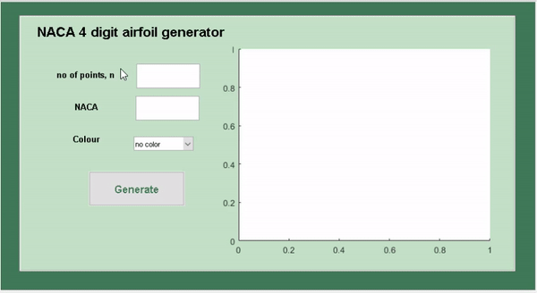

# 4 Digit_NACA_AirFoil_Generator

## Getting Started

To generate a Four digit NACA Airfoil using Matlab GUIDE

### Instalation

* Download and Install Matlab - [Matlab](https://www.mathworks.com/products/matlab.html) 
* Download and Install GNU Octave - [GNU Octave](https://www.gnu.org/software/octave/)

 
 ## Deployment 
    
  
  
  Run ``airfoil_generator.m`` on matlab or octave and to edit the design open the ``airfoil_generator.fig`` in matlab 
    
 

### IMPORTANT

This program is  free and there is NO WARRANTY. You can use, modify and redistribute it for personal, non-profit, educational 
purpose under your OWN RESPONSIBILITY.

 
